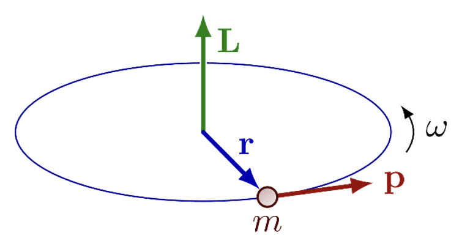

---
jupytext:
    formats: md:myst
    text_representation:
        extension: .md
        format_name: myst
kernelspec:
    display_name: Python 3
    language: python
    name: python3
---

# Angular momentum

## Classical angular momentum

`[slide]`

Symmetries in physics lead to conservation laws - for instance, translation symmetry leads to linea momentum conservation - this is the reason why the velocity of a moving body remains constant if no forces act on it. 

Similarly, if a system is rotationally symmetric like a bicycle wheel, the angular momentum is conserved. What is this classical angular momentum? In physics this is explained in classical mechanics courses, here a summary.

For a point mass, the angular momentum is defined by

$$L=r\times p
$$

where the vector $L$ is the angular momentum, $r$ the position of the mass, and $p$ the linear momentum equal to mass times velocity: $p=mv$. Of course the mass would not follow a circular path - therefore we assume that it is connected to the coordinate system origin by a string:



The angular momentum is an extensive quantity, so for a composite system and not a point-like particle, it is the sum of the AM of the constituents of the body.

## Angular momentum algebra

`[slide]`

We can use again canonical quantization, where the classical quantities are replaced by operators.

So we have $\hat{L}=\hat{r}\times\hat{p}$, where $\hat{p}=-i\hbar\nabla$ for the (linear) momentum operator using nabla.

We now want to figure out what quantum mechanical momenta are allowed. Similar to the procedure we used for finding solutions and eigenvalues for the 3D Schrödinger equation, we now do the following:

1. We derive the commutation relations which are more complex because we have 3 components ($x,y,z) of the AM operator.
2. We again derive ladder operators which increase or decrease the angular momentum, and derive the commutation relations thereof.
3. We find the lowest angular momentum state, and then figure out which eigenvalues are allowed.

`[slide]`

You can follow the derivations in Griffith chapter 4.3, here only the results. We have 3 angular momentum operators along the 3 coordinates

$$
L_x, L_y, L_z
$$

We derive the commutation relations:

$$
\left[L_x, L_y\right]=i \hbar L_z ; \quad\left[L_y, L_z\right]=i \hbar L_x ; \quad\left[L_z, L_x\right]=i \hbar L_y
$$

Note that the indices can be permuted *cyclic*, so you have only to remember one. The non-vanishing commutator means that we never can measure all 3 components of the quantum orbital angular momentum at the same time with infinite precision! Remember that we had the same argument for position and momentum.

However, the square of the total angular momentum $L^2 \equiv L_x^2+L_y^2+L_z^2$ does commute with the cartesian components:

$$
\left[L^2, L_x\right]=0, \quad\left[L^2, L_y\right]=0, \quad\left[L^2, L_z\right]=0
$$

This means we can measure those quantities with arbitrary precision at the same time!

The ladder operators are $L_{ \pm} \equiv L_x \pm i L_y$, which therefore also commute with $L^2$. 

We start by defining $\hbar\ell$ as the highest angular momentum state $L_z f_t=\hbar \ell f_t$, then we can calculate the eigenvalue of $L^2$ using the ladder operator algebra and we obtain $L^2 f_t=\hbar^2 \ell(\ell+1)\lambda f_t$. 

Now we do the same with bottom rung of angular momentum states, and we find that it must have $m=-\ell$. 

So, the eigenstates of $L_z$ are $m\hbar$ where $m$ goes from $-\ell$ to $\ell$ in $N$ integer steps, or $\ell=\ell+N$. Therefore $\ell=N/2$ which means that $\ell$ is either integer or half-integer!

We summarize:

$$\begin{align*}
L^2 f_{\ell}^m&=\hbar^2 \ell(\ell+1) f_{\ell}^m\\
L_z f_{\ell}^m&=\hbar m f_{\ell}^m\\
\ell&=0,1 / 2,1,3 / 2, \ldots\\
m&=-\ell,-\ell+1, \ldots, \ell-1, \ell
\end{align*}$$

Exciting, half-integer values are possible -prob we will come back to this.


## Quantum angular momentum example

`[slide]`

We now discuss what the obtain relations imply for an example with $\ell=2$. First, we plot a 3D sphere with a radius of the length of $|L|=\sqrt{2(2+1)}\approx 2.45$ - classically $L$ could be oriented towards any point on this sphere.

```{code-cell} ipython3
:tags: [hide-input, remove-output]

from matplotlib import pyplot as plt
from myst_nb import glue
from numpy import *

def pol2cart(r, theta, phi):
    theta=pi/2+theta
    return [r * sin(theta) * cos(phi),r * sin(theta) * sin(phi),r * cos(theta)]

fig = plt.figure()
ax = fig.add_subplot(projection='3d')
ax.set_aspect("equal")
ax.view_init(elev=10, azim=10, roll=0)

rr=3
ax.plot([0,rr],[0,0],[0,0],'r-', linewidth=3)
ax.plot([0,0],[0,rr],[0,0],'g-', linewidth=3)
ax.plot([0,0],[0,0],[0,rr],'b-', linewidth=3)

thax=linspace(-pi,pi,50);
fiax=linspace(0,2*pi,50)

ll=sqrt(2*(2+1))
c1=pol2cart(ll,thax,pi/2)
ax.plot(c1[0], c1[1], c1[2], color="0.5", alpha=0.5)
for m in [-2,-1,0,1,2]:
    print("m=", m, " as=", arcsin(m/ll))
    c1=pol2cart(ll,arcsin(m/ll),fiax)
    ax.plot(c1[0], c1[1], c1[2], color="0.4")
    c1=pol2cart(ll,arcsin(m/ll),pi/2)
    ax.plot([0,c1[0]],[0,c1[1]],[0,c1[2]], color="cyan", linewidth=2.5)
    
ax.set_xticks([]); ax.set_yticks([]); ax.set_zticks([])
plt.show()

glue("am-l-two", fig, display=False)
```

(am-l-two)=
```{glue:figure} am-l-two
Possible angular momentum orientations for $\ell=2$. We see allowed $L$ orientations at $z$-values of $-2,-1,0,1,2$.
```

In quantum mechanics, however, the conditions on the quantum number $m$ determines which expectation values of $L_z$ can exist - and this only reaches $2$! This and the other $m$-values are indicated as circles on the sphere, because the polar orientation of $L$ is arbitrary.

This sounds crazy - why can't I choose the z-axis along $L$?, this should solve the problem that not all components of $L$ can be measured simultaneously?

Quantum mechanics predicts that this simply can't be done - and this agrees very well with observation as we will see in the future. 

## Quantum angular momentum eigenfunctions

<!-- [G4.3.2] -->
`[slide]`

Now we want to derive the eigenfunctions of the orbital angular momentum operators, in particular again for the electron of the Hydrogen atom. We first write the operators in spherical coordinates, we had $\mathbf{L}=-i \hbar(\mathbf{r} \times \boldsymbol{\nabla})$ with nabla operator in spherical coordinates:

$$
\nabla=\hat{r} \frac{\partial}{\partial r}+\hat{\theta} \frac{1}{r} \frac{\partial}{\partial \theta}+\hat{\phi} \frac{1}{r \sin \theta} \frac{\partial}{\partial \phi}
$$

We write down the eigenvalue equations where we know already the eigenvalues, first for $L^2$:

$$
L^2 f_{\ell}^m=-\hbar^2\left[\frac{1}{\sin \theta} \frac{\partial}{\partial \theta}\left(\sin \theta \frac{\partial}{\partial \theta}\right)+\frac{1}{\sin ^2 \theta} \frac{\partial^2}{\partial \phi^2}\right] f_{\ell}^m=\hbar^2 \ell(\ell+1) f_{\ell}^m
$$

and for $L_z$:

$$
L_z f_{\ell}^m=-i \hbar \frac{\partial}{\partial \phi} f_{\ell}^m=\hbar m f_{\ell}^m
$$

Now you might see that we have already seen these equations, and we know that the eigenfunctions are the spherical harmonics $Y_l^m$!

But you might notice that before, by the method of separation of variables, only integer values for $\ell$ were allowed - and now, using the algebraic theory of angular momentum operators, also half-integer values are possible. This is a crucial result - the algebraic theory of angular momentum leads to the concept of half-integer angular momentum which will turn out to be the "spin", discussed in the following lectures.

<!-- TODO Q peter denteneer: understand why this is so. -->

