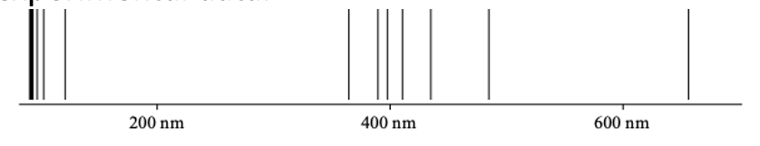

---
jupytext:
    formats: md:myst
    text_representation:
        extension: .md
        format_name: myst
kernelspec:
    display_name: Python 3
    language: python
    name: python3
---

# Evidence for quantum mechanics

## Quantizations

`[slide]`

What were the first indications that we need quantum mechanics to understand nature?

We first clarify, historically there are two so-called "quantizations" which both are usually called "quantum" effects:

The first quantization is that we have to describe things with (quantum) waves that are usually (or previously) assumed to be particles, such as atoms or electrons. Note that this is not needed for light, at least not since Maxwell! 

But how do we get the quantum in light waves?

This is described by the "second quantization", where wave fields are again quantized, for instance, we can detect or make a single photon!

Note that we currently think that in particular the 2nd quantization is essential to build quantum machines which can do something really exciting.

## Black body radiation

`[slide] black body`

Light has already long ago been postulated to consist of light particles, however wrongly, more often it was thought to consist of EM waves since interference effects are evident even in every-day physics, think of the color of soap bubbles. In 1900 Max Planck published a theory of black-body radiation – this is about thermal radiation in equilibrium with a perfectly absorbing body – despite not black, the sun is to a good degree a BB. The spectra of BB could not be explained unless assuming that atoms emit and absorb discrete quanta of radiation with energy E=h.f, where f is the frequency of the radiation and h is a fundamental constant of nature, the Planck constant with a value of $6.626\cdot 10^{-34}\,\mathrm{J s}$.

TODO: graph of planck spectrum.

## The energy of a photon
`[slide]`

Photons are particle-like quanta of electromagnetic radiation. In vacuum, they travel with speed c, another fundamental constant of nature. By using the property of any monochromatic (single-frequency) wave linking propagation speed to frequency and wavelength, $c=\lambda f$, $E=hc/\lambda$, and momentum $p=h/\lambda$. 

TODO: pic wave with c, lambda, frequency

Let’s look at some numbers, for instance for a candle. A candle emits 1 "candela" and we assume the wavelength is (average) $\lambda=555nm$, which is yellow.

1 candela is 683 Joule per second. However, a Joule is a bad unit for photon energies since they are very small. We often use "electron Volts" eV, and a single 555 nm photon has $2.23\,\mathrm{eV}$. Therefore, our candle emits $10^{16} photons per second!

## Double slit interference

`[slide] double slit]`

<!-- see Phillips fig. 1.2+1.3 -->

Nowadays we have access to arrayed cameras which have a noise level low enough to observe the absorption of single photons. This allows us to repeat known wave-optical experiments but see photons arriving one by one, if the light source is weak enough. 
Let's look at a classical interference experiment, the double-slit experiment. Here, a coherent laser source impinges on two narrow slits and far away an interference pattern can be observed:

TODO pic with interference pattern

We show in an exercise how this pattern can be calculated – for now it is enough to realize that the Huygens elementary waves emerging from the two slits have a path length difference that is proportional to $x$ and as a function of $x$, interference changes between destructive and constructive, therefore the wavy pattern visible on the right appears with intensity $I=E^2=\sin^2(x*c)$ where $c$ depends on the parameters of the experiment.

Note that this is a wave-optical interference experiment and works in principle equally well for water waves.

### A single photon in a double slit

`[slide]`

Now we use our single-photon sensitive camera for detection. We see that each photon is detected at one specific position – but this position is largely random, however, if we wait and collect enough data we see that the probability follows the intensity distribution: P(x) is like the intensity before I(x) – which is the square of the electric field – as we see later, we can see the dimensionless and normalized E(x) as the quantum wavefunction of photons – Psi(x)!
Note that the interference pattern disappears if one of the two slits is blocked – therefore the “photon” wave must have gone through both slits at once.
The double slit experiment with single-photon detection shows (i) quantum superpositions, that waves from one slit and the other perform quantum interferences, and (ii) that the wavefunction of a photon is truly non-local, it is nonzero for different positions. This sounds trivial here but becomes very fundamental if we take the particle aspect seriously – quantum nature is “nonlocal”, in contrast to our everyday experience of the “classical world”.

TODO: pic with single photon camera

`[slide] particle interference`

At the beginning of the 20th century, it was not clear that such interference doesn’t happen also for objects that people call particles. Nowadays, electron diffraction is observed regularly in transmission electron microscopes, neutrons are diffracted in crystals, and in dedicated experiments physicists have observed interference of buckeyballs (C60), many different molecules up to around 15k atoms. [some pics from Aspelmeyer & Hornberger, Nat. Phys. 14, 271 (2014)]. It is the theory of quantum mechanics that allows description of all these exciting experiments. There is a world-wide effort in increasing the size and mass of such “massive quantum superpositions” – we will see that the bigger the system gets, the harder is to exclude known reasons why we don’t see quantum interference – but currently the question why I find myself never in a spatial quantum superposition is not fully answered. The reason might lie that we don’t know how gravity acts in the quantum domain – we don’t have a quantum theory of gravity yet.

TODO: pics

## Atomic emission lines

`[slide] atomic emission lines`

Another strong indication that electrons also have wave character came from observing emission from molecular gas (most gases are molecular) and atomic vapour such as from sodium. Physicists observe narrow bright “lines” and not a continuous emission spectrum as expected from black body radiation. Now, it turns out that these emission frequencies can be explained by assuming that the electron is described by a wave where allowed energies correspond waves with particular radii such that the electron wave repeats itself after one round trip., in the Born picture one calculates simply for which electron energies one obtains constructively interfering orbits of the electron and finds good agreement to experimental data.

<!-- TODO: figure from ph fig1.5 -->

TODO: some pic with waves around atom

The underlying physics of all these phenomena will be explained in this course. Moreover, we will also show that quantum mechanics is needed to understand why atoms are stable in the first place, why the electron “does not fall” into the atomic nucleus.

