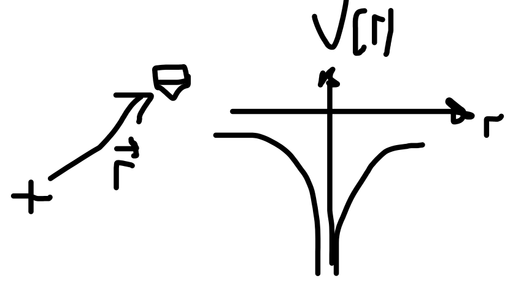

---
jupytext:
    formats: md:myst
    text_representation:
        extension: .md
        format_name: myst
kernelspec:
    display_name: Python 3
    language: python
    name: python3
---

# Schrödinger equation

## Towards time independent solutions

### The need for potential energy 

`[slide]`
<!-- [Ph2.2] -->
We want to describe quantum behaviour of particles, which usually are not in free space but bound by a certain potential – we need to add this to the Schrödinger equation, this is usually done by adding a potential energy that is dependent on position. 

For example, an electron in a hydrogen atom is mainly bound to the positively charged proton core by the Coulomb force, which can be written by the potential energy 

$$V\left(r\right)=-\frac{e^2}{4\pi\epsilon_0r}$$

This energy is negative, which means attractive for all radial distances, and strongest close to $r=0$. 

As you can imagine, this is not the end of the story, other forces, including the Pauli exclusion principle which we discuss later, and the so-called strong force will lead to a repulsive force for very small distances, but we can ignore this for now. 

We have seen before that the second-derivative term of the Schrödinger equation is simply the kinetic energy of the particle, therefore it is not too crazy to simply add the potential energy to it. The one-dimensional Schrodinger equation including a one-dimensional position-dependent potential $V(x)$ becomes: 

$$
i\hbar\frac{\partial\Psi}{\partial t}=-\frac{\hbar^2}{2m}\frac{\partial^2\Psi}{\partial x^2}+V\left(x\right)\Psi. 
$$

TODO fig :)

### Separation of variables

`[slide]`
<!-- Gr 2.1. -->

We still carry the time dependence of the wave function, how fast does it actually oscillate for a realistic particle? This is very fast and we often average over this in experiments (as we do for the E-field oscillations for light), how can we simplify the equation?

This is the method of separation of variables, we try to write $\Psi$ as 

$$
\Psi\left(x,t\right)=\psi(x)\phi(t)
$$

Let’s put this back into the Schrodinger equation, we obtain for the derivatives 

$$
\frac{\partial\Psi}{\partial t}=\psi\frac{d\phi}{dt}
\\
\frac{\partial^2\Psi}{\partial x^2}=\frac{d^2\psi}{dx^2}\phi
$$

With this the Schrödinger equation becomes 

$$
i\hbar\psi\frac{d\phi}{dt}=-\frac{\hbar^2}{2m}\frac{d^2\psi}{dx^2}\phi+V\psi\phi
$$

Dividing by $\psi\phi$ gives

$$
i\hbar\frac{1}{\phi}\frac{d\phi}{dt}=-\frac{\hbar^2}{2m}\frac{1}{\psi}\frac{d^2\psi}{dx^2}+V
$$

On the left side is a function of only $t$, and the right side a function of only $x$ – both need therefore to be constant! We now set both sides equal to a constant $E$, and we end up with two ordinary differential equations: 

$$
\frac{d\phi}{dt}=-\frac{iE}{\hbar}\phi
$$

and 

$$
-\frac{\hbar^2}{2m}\frac{d^2\psi}{dx^2}+V\psi=E\psi.
$$

The first is independent on V and can be simply solved by integration, giving: 

$$
\phi\left(t\right)=e^{-\frac{iEt}{\hbar}}
$$

This is an oscillation, therefore $\phi$ is also called the "wiggle factor".

The second equation is the time-independent Schrodinger equation, and can only be solved when we know $V(x)$.

TODO Quick check exercises: Gr 2.1a show that E must be real. Gr 2.2 Show that E must be positive.  [MB thinks last one is too hard]

### Probability densities

`[slide]`

Even though the wave function is time-dependent

$$
\Psi\left(x,t\right)=\psi\left(x\right)e^{-iEt/\hbar}
$$

the probability density is not: 

$$
\left|\Psi\left(x,t\right)\right|^2=\Psi^\ast\Psi=\psi^\ast e^{+iEt/\hbar}\psi e^{-iEt/\hbar}=\left|\psi\left(x\right)\right|^2
$$

We call such solutions “stationary” states. This also means as we will see later, that the expectation value of any dynamical value such as position and momentum are time independent – this sounds reasonable for a large number of systems. For instance for a particle at rest, the expectation value of the position $x$ is constant, and momentum $p=0$ – nothing moves.

<!-- [G eq. 2.10] -->
Now we discuss what $E$ means. In classical mechanics, the total energy of a system is given by the sum of kinetic and potential energy:

$$
H(x, p)=\frac{p^2}{2 m}+V(x)
$$

Using a procedure that physicists call “canonical replacement” and which will be proven to be reasonable, we can derive from this a Hamiltonian “operator” that acts on wave functions:

$$
\hat{H}=-\frac{\hbar^2}{2 m} \frac{\partial^2}{\partial x^2}+V(x)
$$

The eigenvalues of this operator is the energy of the system for the specific wavefunction, and we are back to the Schrödinger equation:

$$
\hat{H} \psi=E \psi
$$

TODO Exercise/slide: show that this makes sense with a de Broglie wave

### Expectation values of operators

`[slide]`
<!-- Ph3.5.  -->
As we have seen before, the outcome of a measurement in QM is a random variable, and we call the average value of this the expectation value. It can be determined by measuring an ensemble of identically prepared systems, or repeating the experiment many times.

Let us look at the position. We assume that we have a particle with a wavefunction $\Psi(x,t)$, which is the probability amplitude of the position observable and $|\Psi(x,t)|^2*dx$ is the probability of finding the particle between $x$ and $x+dx$. The position expectation value is therefore

$$
\langle x\rangle=\int_{+\infty}^{-\infty} x|\Psi(x, t)|^2 \mathrm{~d} x
$$

If we have many copies of the same system and measure repeatedly the position, the position average will be this expectation value.

Similarly, if we have a wave function of the momentum observable $\tilde{\Psi}(p, t)$, the expectation value is

$$
\langle p\rangle=\int_{-\infty}^{+\infty} p|\tilde{\Psi}(p, t)|^2 \mathrm{~d} p
$$

The momentum and position expectation values are related by a classical relationship

$$
\langle p\rangle=m \frac{\mathrm{d}\langle\mathbf{x}\rangle}{\mathrm{d} t}
$$

For $x$ and $$ above it was not obvious, but this contains clear signs of an operator – the differential operator. 

The position and momentum operators are in the position basis: 

$$
\hat{x}=x,\quad\hat{p}=-i\hbar\frac{\partial}{\partial x}
$$

and we can calculate their expectation values e.g. like this: 

$$
\langle p\rangle=\int_{-\infty}^{\infty} \Psi^*(x, t)\left(-i \hbar \frac{\partial}{\partial x}\right) \Psi(x, t) d x
$$

The linear algebra becomes complete if we realize that for an operator $\hat{Q}$ $\langle Q\rangle$ is shorthand for 

$$
\langle Q\rangle \equiv \langle\Psi|Q|\Psi\rangle = \int dx\,\Psi^\ast Q \Psi
$$

Where in the last step we have again shown the integral over the dependent variable $x$.

