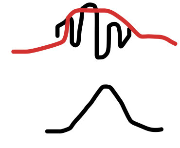

---
jupytext:
    formats: md:myst
    text_representation:
        extension: .md
        format_name: myst
kernelspec:
    display_name: Python 3
    language: python
    name: python3
---

# Free particle

## De Broglie & Heisenbgerg

`[slide]`

<!-- Ph 1.2.  -->
An important step towards a quantum mechanical description of massive particles was done by Louis de Broglie in 1923. He proposed that a fundamental or composite particle with momentum p also has the properties of a quantum wave (like light) with wavelength $\lambda=\frac{h}{p}$, now called the de Broglie wavelength. 

<!-- Ph 2.2.  -->
With this as a starting point, we can already propose a wave equation for a freely moving particle if its speed is non-relativistic. We assume that the particle is moving at a velocity $v\ =\ p/m$ in the $x$ direction with mass $m$, momentum $p$ and energy $E=p^2/m$. 

With this we can already describe the Heisenberg uncertainty principle:

The de Broglie wave can also be described with wavenumber $k=\ \frac{2\pi}{\lambda}$ and we can rewrite the momentum to be $p=\hbar k$. Now, a wave packet consisting of a range of wave numbers between $k-\Delta k$ and $k+\Delta k$ describes a particle with an uncertain in momentum: $\Delta p\approx\hbar\Delta k$. 

The length of this wavepacket is a measure of the uncertainty in position, and it can be shown to be simply $\Delta x\approx\ 2\pi/\Delta k$. Note, the derivation of this requires a fourier transform! 

If we multiply these uncertainties we obtain $\Delta x\Delta p\approx h$, therefore de Broglie wave packets automatically lead to the Heisenberg uncertainty principle! 

Two notes: first, this is the maximum precision so we better write $\Delta x\Delta p\ge\ h$, and second, the precise numeric value on the right-hand side depends on the specific waveform of our wavefunction.

The condition for the wavepacket to describe a moving quantum particle is that the group velocity of the packet is equal to the velocity of a particle with mass $m$ and momentum $p\ =\hbar k$.

TODO pic: wavepacket in x- and k-space

## Phase and group velocity

<!-- Additional: Philips 2.1 -->
`[slide]`

For derivation of our differential wave equation, it is essential to find how the energy of the particle depends on the wave vector or frequency of the wave. From $E=\hbar\omega$ and previous equations we find $d\omega/dk\ =\hbar k/m$, which by integrating results in the dispersion relation $\omega\ =\hbar k^2/2m$. The task is to find a wave equation that obeys this dispersion relation. 

The skilled eye will see that the equation  

$$
i\hbar\frac{\partial\Psi}{\partial t}=-\frac{\hbar^2}{2m}\frac{\partial^2\Psi}{\partial x^2}
$$

will be such an equation – this is the Schrodinger equation for a "quantum wave function" $\Psi$ describing a free particle moving in one dimension.

Note that the main goal of physics research is to develop models to describe nature, and not to explain "why" something is like it is - of course it is most satisfying when we can explain "why" something is - but often this is just in relation to our models. So, please accept this equation for now - we will see it works often extremely well!

One solution to this wave equation is 
$\Psi\left(x,t\right)=Ae^{i(kx-\omega t)}$, which is called a plane wave moving in the $x$ direction. The momentum $k$ is obviously well defined, and we see that the wave has a non-vanishing amplitude all over space – therefore Heisenberg uncertainty is preserved: $\Delta k=0$ and $\Delta x=\infty$. The momentum is $p\ =\hbar k$ and energy $E=p^2/m=\hbar\omega$.

TODO animated plot: wave packet evolving and moving in time, without dispersion.
v_phase=v_group 

TODO Quick question: verify that real functions Acos(k x – w t) and Asin(k x – w t) are not solutions – remind yourselves of Euler’s formula.
<!-- Ph problem 2.3 -->

## Possible wavefunctions

`[slide]`

Since $\Psi$ appears only linearly (no powers) in the differential equation, we say that the Schrödinger equation is linear in the wavefunction $\Psi$. As a consequence, any superposition of solutions for instance with a different wavelength or wavevector $k$, is also a solution. 

TODO Quick question: confirm that $\Psi(x,t)=A_1 e^{i(k_1x-\omega_1 t)}+A_2 e^{i(k_2x-\omega_2 t)}$ is also a solution. 

The most general solution of our one-dimensional Schrödinger equation is a superposition of complex-exponential waves with many angular frequencies and wavenumbers: 
$$\Psi\left(x,t\right)=\ \sum_{n=1}^{\infty}{A_n(k_n)e^{i\left(k_nx-\omega_nt\right)}}$$

where $\hbar\omega_n=\frac{\hbar^2k_n^2}{2m}$. If $A_n(k_n)$ is such that the sum involves only a narrow range of wave numbers around a positive value $k$, this superposition yields a wave packet moving in the positive $x$ direction with a group velocity $\hbar k/m$. In free space, such a wave packet describes a quantum particle moving at velocity $\hbar k/m$, preserving shape during propagation, but the position and momentum uncertainties are in agreement with the Heisenberg uncertainty principle as explained before.

Todo: 2 plots of wavepacket of slide before: (I) real space Re(Psi(x,0)) (ii) Fourier space   Possibly: add Griffiths 2.1 

