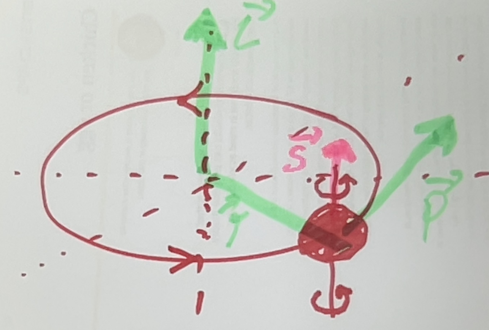
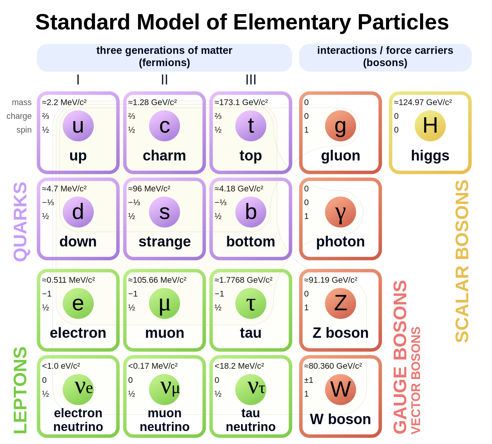

---
jupytext:
    formats: md:myst
    text_representation:
        extension: .md
        format_name: myst
kernelspec:
    display_name: Python 3
    language: python
    name: python3
---

# Spin: concepts

## Classical spin

`[slide]`

Classically, a body can show an orbiting motion and a spinning rotation, like the earth orbits once a year around the sun and spins every day around the earth center. If we place the origin of our coordinate system at the cenrter of the sun, it is clear from the classical-mechanics law $L=r \times p$ that the orbital angular momentum of the earth is nonzero and in our case points upwards, to the north. 

The spinning rotation leads to a spin angular momentum around the center of mass of the spinning body, which is calculated using the same equation $L=r \times p$ for all constituents that make op the earth. Approximately, the SAM does not contribute to $L$ measured around the origin, but it is clear that both have the same origin and the distinction is largely semantically. Also, a point-like particle cannot have a spin angular momentum classically, because $r$ is zero if measured from the center of mass of the particle.

## Quantum spin

`[slide]`

In quantum mechanics, however, the case is very different, and there is a fundamental difference between orbital and spin angular momentum. First, for the OAM, we remember that we had seen that quantum particles can have a certain OAM determined by the AM quantum number $\ell$ - and that this corresponds to an angular momentum of magnitude $L=\hbar\sqrt{l\left(l+1\right)}$. Now, if we measure for instance the $z$-component of the OAM using the operator $L_z$, we obtain $L_z=\hbar m_l$ where $m_l$ is one of $2\ell+1$ values between $-\ell$ and $+\ell$. 

Remember that this can only be done for $L$ and $L_z$, but not for $L_z$ and $L_x$ or $L_y$ - they are not well-defined simultaneously. 

Now, it is one of the most profound discoveries in quantum mechanics that fundamental particles in nature seem to have a spin angular momentum, despite they are considered to be “point like” if their position is measured. Note: if we measure e.g. the position of the electron in the hydrogen atom many, many times, we will of course reproduce the spatial wavefunction probability distribution which we have seen before – but as far as we know, the electron should be considered a point-like particle if its position is measured. This is fascinating and very different to a classical world, you will get used to it. 

The spin is so important in quantum mechanics because of a number of reasons, but probably above all because all known fundamental particles (electron, photon, quarks, gluons and a few more) have a nonzero spin - except for the recently discovered Higgs boson, which was confirmed experimentally in 2013 – it has zero spin.

## Spin Operators and Commutation Relations

`[slide]`

We now state the algebraic quantum theory of spin by exact analogy to the derivation of the quantum orbital angular momentum. Instead of $L$ we use $S$, and instead of $m_l$ we use $m_s$. Note that the subscript is sometimes omitted, it should be clear from the context. The operator commutation relations we write now shorter using the Levi-Civita symbols $\epsilon_{klm}$. $\epsilon_{klm}$ is $+1$ if $k,l,m$ are cyclic like $1,2,3$ or $2,3,1$, and $-1$ if anti-cyclic, and zero otherwise.

$$
\left[S_k, S_l\right]=i \hbar S_m \epsilon_{k l m}
$$
 
Again, the cartesian spin components do not commute and cannot be simultaneously known  due to the uncertainty principle. On the other hand, $\left[S^2,S_i\right]=0$, so the spin vector length commutes with each of the individual components and can be known and measured simultaneously with arbitrary precision. 

## Spin Eigenvectors and Eigenvalues 

`[slide]`

We introduce the spin quantum number $s$ and the quantum number of $S_z$, $m_s$ and obtain as before for the OAM:

$$
\begin{matrix}S^2\left|s,m_s\right\rangle=\hbar^2s\left(s+1\right)\left|s,m_s\right\rangle:&&S_z\left|sm_s\right\rangle=\hbar m\left|sm_s\right\rangle\\\end{matrix}
$$

In contrast to the OAM, we do not know the eigenfunctions and it does not make sense to restrict ourselves to integer $s$ and $m_s$, which was needed for the OAM with the spherical harmonic eigenfunctions to make sense (single valued). Therefore also half-integer values are allowed as resulted from the algebraic theory of AM before: 

$$
\begin{matrix}s=0,\frac{1}{2},1,\frac{2}{3},\ldots;&&m_s=-s,-s+1,\ldots,s-1,s\\\end{matrix}
$$

Experimentalists have measured $s$ (you will see later how) for all elementary particles and found that every elementary particle has a specific spin $s$ – as mentioned above only the recently discovered Higgs boson has zero spin. But, classification of particles by their spin is also very useful for composite particles like a proton that consists of several quarks and gluons – but the case is very complicated if done exactly, and still subject to research. 

The so-called standard model particle physics is shown here, where we see the quarks building up the nuclei with spin $1/2$, the lightweight particles, leptons also with spin $1/2$, exchange particles with integer spin, usually $1$ except for the Higgs boson which has zero spin. Missing is the graviton, the exchange particle of gravity, we don't know yet if it really exists - we don't have a clear model of quantum gravity yet nor do we know if this model exists, but if it does, the graviton might have spin $2$.

For our daily interactions with nature, but also for quantum information science, two spins are in particular important: $s=1$, for the photon, the quantum particle of light, and $s=1/2$, which is the spin of the electron, protons, and neutrons – key constituents of matter. 

[Image credit](https://en.wikipedia.org/wiki/Standard_Model)

