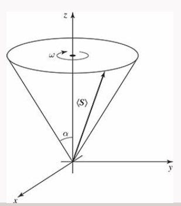

---
jupytext:
    formats: md:myst
    text_representation:
        extension: .md
        format_name: myst
kernelspec:
    display_name: Python 3
    language: python
    name: python3
---

# Magnetic fields

<!-- Griffiths 4.4.2(but much better text in Ph8.2 TODO: think if to include higher AM) -->

## An electron in a magnetic field

`[slide]`

A particle with spin is a little magnet – called a magnetic dipole, with a north and south pole like the earth magnetic field. Its magnetic dipole moment $\vec{\mu}$ is proportional to its spin angular momentum, $\vec{S}$:
$\vec{\mu}=\gamma\vec{S}$. 

The proportionality constant $\gamma$ is called the gyromagnetic ratio. Now, we place the electron with its magnetic dipole moment in a magnetic field $\vec{B}$. This leads to a torque acting on the dipole $\vec{\mu}\times\vec{B}$, which tries to line up the dipole moment parallel to the field, just like a compass needle. We can obtain the Hamiltonian of this system by using the energy of the magnetic moment in the magnetic field $-\vec{\mu}\cdot\vec{B}$, and replacing the moment by the spin operator:

$H=-\gamma\vec{B}\cdot\vec{S}$

The resulting energy splitting of different spin states is very important for manipulating such a spin-qubit. We now show two important effects for a spin in a magnetic field.

## Larmor Precession

`[slide]`

This example is worked out in more detail in Griffith example 4.3 – please have a look! We start with a spin along a certain direction $\vec{S}$, in a magnetic field in $z$-direction: $\vec{B}=B_0 \vec{z}$. The Hamiltonian then becomes

$$
H=-\gamma B_0 S_z=-\frac{\gamma B_0 \hbar}{2}\left(\begin{array}{cc}
1 & 0 \\
0 & -1
\end{array}\right)
$$

And we know already the eigenstates of $S_z$, they are the spin-up and down states. As shown in Griffith, the solution is that the spin rotates around the B-field with the so-called Larmor frequency $\omega=\gamma B_0$. As you can probably imagine, the relative phase of the spin-up and spin-down components change during rotation, therefore is this Larmor precession an important tool for spin qubit manipulation in the lab.


TODO: re-do, griffith 4.14

## The Stern-Gerlach experiment

`[slide]`
<!-- [Griffith example 4.4] -->

From magnetostatics in physics it was already long known that a magnetic dipole in an inhomogeneous magnetic field experiences not only a torque, but also a net force - we assume here that the magnetic field varies along the $z$-axis, and consider only the $z$-component of the magnetic moment:

$$
F_z=µ_z\frac{\partial B}{\partial z}
$$

We now consider that the B-field only changes along the $z$ direction, and we ignore the $x$-component of the spin because this will in fact average out due to the Larmor precession. From before we know that $\vec{\mu}=\gamma \vec{S}$ , and we obtain for the force:

$$
F_z=\gamma\alpha S_z
$$

Where $\alpha$ describes the strength of the gradient along the $z$-direction of the $B$-field.

Now we send electrons with arbitrary spin orientation through the Stern-Gerlach experiment shown here, with the magnets producing the inhomogeneous magnetic field and a plate on the right for detection of the electrons. 


```{figure} figures/spin/stern-gerlach.png
The Stern-gerlach experiment. A silver atom stream (2) is produced in an oven (1), send through the inhomogeneous magnetic field (3). Classically, we would expect a smeared out picture (4) but quantum mechanics correctly predicts the outcome of the experiment (5) of two distinct spots!
``````

In classical physics, $\mu_z$ could have any value, and any force between $-1/2 \gamma\alpha$ up to $+1/2 \gamma\alpha$ is possible, therefore a vertically smeared-out picture on the electron-detecting plate is expected.

The experimental result was very different – two spots were observed, in agreement with our quantum mechanics knowledge!

In quantum mechanics, the magnetic field along the $z$-axis leads to quantization of the magnetic moment along this axis. The eigenstates of $\mu_z$ and $S_z$ are discrete, either $+1$ or $-1$, therefore only two different orientations of the magnetic moment are possible for the electron. This was a crucial smoking gun experiment showing that the description of elementary particles requires quantum mechanics.
For a more detailed discussion, please see Griffiths Example 4.4, or Phillips 8.2

`TODO: here or later in dynamics: G Problem 4.36 An electron is at rest in an oscillating magnetic field`


